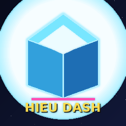

# Hieu Dash

<p align="center">
  
</p>

A rhythm-based platformer for Android, inspired by the cube-jumping genre.
Tap to jump, dodge the spikes, collect coins, reach the goal flag.

> Built with **Godot 4.7** • Targets **Android 7.1.1 (API 24)+, Linux, Windows** • v0.4.0

This is the **v0.4** release. It fixes critical APK installation issues, Godot 4.7
script compile errors, and ships a fresh new neon-cube logo. For full details see
[CHANGELOG.md](CHANGELOG.md).

---

## Features (v0.4)

- **Auto-running cube** with gravity + jump (tap / space / click)
- **Procedural level generation** driven by seed (deterministic, advances per level)
- **10 obstacle types**: spikes, blocks, coins, saw, pit, spike strip, bouncer, crusher, laser, moving platform
- **Goal flag** at the end of the level → level complete + bonus
- **Scoring system**: distance + coins + completion bonus, displayed in HUD and end screens
- **Procedural audio**: jump, coin, death, land, bump, looping BGM
- **HUD**: progress bar, attempt counter, coin counter, score counter, pause button
- **Pause menu**: resume / restart / main menu
- **Game Over** & **Level Complete** screens with score breakdown
- **Main Menu** with logo, best score, total coins, level selector
- **Settings**: music / SFX / reduced motion toggles, reset progress
- **Persistent save** (`user://hieu_dash.save`) — best score, total coins, attempts, completions
- **Visual polish**: parallax background (3 layers), particle trail, landing particles, death explosion
- **Neon GD-inspired UI** (custom StyleBoxFlat, color palette, glow)
- **Android adaptive icons** (foreground + background)
- **Reduced motion mode** for accessibility
- **Coyote time** + jump buffer for responsive controls
- **CI/CD**: GitHub Actions auto-builds APK / Linux / Windows on every release

---

## Minimum requirements

| Spec            | Value                              |
|-----------------|------------------------------------|
| Engine          | Godot 4.7+                         |
| Platforms       | Android, Linux (x86_64), Windows (x86_64) |
| Android min SDK | API 24 (Android 7.1.1)             |
| Android target  | API 34 (Android 14)                |
| Architectures   | `armeabi-v7a`, `arm64-v8a`, `x86_64` |
| Renderer        | `gl_compatibility` (GLES2 mobile)  |

---

## How to play

1. **Tap anywhere / Space / Left-click** → jump
2. Hold to buffer a jump on landing (jump buffer window ≈ 120 ms)
3. **Spikes (red triangles)** → instant death → restart
4. **Blocks (purple squares)** → land on top to ride, hit the side → death
5. **Coins (yellow diamonds)** → +1 coin, +50 score
6. **Saw (grey circle)** → rotating blade, deadly on contact
7. **Pit (black gap)** → fall in = death
8. **Spike strip (wide red row)** → multiple spikes in a row
9. **Bouncer (orange pad)** → launches you extra high
10. **Crusher (red block)** → slams down periodically, deadly when falling
11. **Laser (red beam)** → toggles on/off, deadly when on
12. **Moving platform (green)** → rides horizontally or vertically
13. **Goal flag (green)** at the end → level complete (+1000 bonus)
14. **Pause button** (top-right) or **Esc / Back** to pause

Score: +1 per 10 px forward, +50 per coin, +1000 on completion.

---

## Building

### Prerequisites
- [Godot 4.7](https://godotengine.org/) (Standard or .NET — this project uses GDScript, so Standard is enough)
- For Android: Android SDK + NDK configured in Godot's Editor Settings → Export → Android, Java JDK 17+

### Steps
1. Clone this repo: `git clone https://github.com/mhieuhonda/HieuDash.git`
2. Open the project in Godot 4.7 (Project → Import → select `project.godot`)
3. Wait for the asset import to finish
4. Project → Export → **Android**, **Linux**, and **Windows Desktop** presets are already configured (`export_presets.cfg`)
5. Click **Export Project…** → choose release or debug

### CI/CD (GitHub Actions)

The repository includes `.github/workflows/release.yml` which:
- Triggers automatically when a **release is published** (or manually via `workflow_dispatch`)
- Runs **3 parallel jobs**: Android APK, Linux (x86_64), Windows (x86_64)
- Downloads Godot 4.7-stable + export templates
- Imports the project headlessly, exports the binary, zips it
- Uploads the artifact to the release that triggered the build

Artifact naming:
- `HieuDash-<tag>-android.apk`
- `HieuDash-<tag>-linux-x86_64.zip`
- `HieuDash-<tag>-windows-x86_64.zip`

---

## Project structure

```
HieuDash/
├── project.godot              # Godot 4.7 config (autoloads, input map, version)
├── export_presets.cfg         # Android + Linux + Windows presets
├── .github/workflows/
│   └── release.yml            # CI: 3 parallel builds on release published
├── assets/
│   ├── icons/                 # App icons (PNG, adaptive)
│   └── sfx/                   # Procedural WAV audio (jump, coin, death, land, bump, bgm)
├── scenes/
│   ├── MainMenu.tscn          # Title screen
│   ├── Settings.tscn          # Settings (music/SFX/motion/reset)
│   ├── Game.tscn              # Main gameplay scene (HUD, parallax, etc.)
│   ├── Player.tscn            # Cube with trail + land + death particles
│   ├── Spike.tscn             # Hazard: triangle spike
│   ├── Block.tscn             # Static block (jump on top, side = death)
│   ├── Coin.tscn              # Collectible
│   ├── GoalArea.tscn          # End-of-level flag
│   ├── Saw.tscn               # Rotating blade
│   ├── Pit.tscn               # Floor gap
│   ├── SpikeStrip.tscn        # Wide spike row
│   ├── Bouncer.tscn           # Jump pad (boost)
│   ├── Crusher.tscn           # Slamming block
│   ├── Laser.tscn             # Toggling beam
│   └── MovingPlatform.tscn    # Oscillating platform
└── scripts/
    ├── GameManager.gd         # Autoload singleton (save/load, runtime state, scoring)
    ├── LevelGenerator.gd      # Procedural level data (10 entity types)
    ├── Player.gd              # Cube physics: gravity, jump, coyote, ground check, bounce
    ├── Spike.gd, Block.gd, Coin.gd, GoalArea.gd
    ├── Saw.gd, Pit.gd, SpikeStrip.gd, Bouncer.gd, Crusher.gd, Laser.gd, MovingPlatform.gd
    ├── Game.gd                # Main game loop, spawning, HUD, pause
    ├── MainMenu.gd
    └── Settings.gd
```

---

## Roadmap (post-v0.4)

- [ ] Multiple level layouts (level select screen)
- [ ] Cube color customizer (garage)
- [ ] Multiple game modes: ship, ball, UFO
- [ ] Practice mode with checkpoints
- [ ] Level editor
- [ ] Achievements / leaderboards
- [ ] Haptic feedback on death / land
- [ ] Real audio assets (replace procedural WAVs)
- [ ] Localization (multi-language UI)

---

## Credits & license

- **Concept & code**: Hieu Dash Project (2026)
- **UI inspiration**: classic cube-jumping genre
- **Engine**: [Godot Engine](https://godotengine.org/) (MIT license)
- **Font**: built-in Godot default

This project is released under the **MIT License** — see [LICENSE](LICENSE).

"Hieu Dash" is an original name. The game is **inspired by** the cube-jumping
genre but is a separate, original work and is **not affiliated with** any
existing commercial product.
